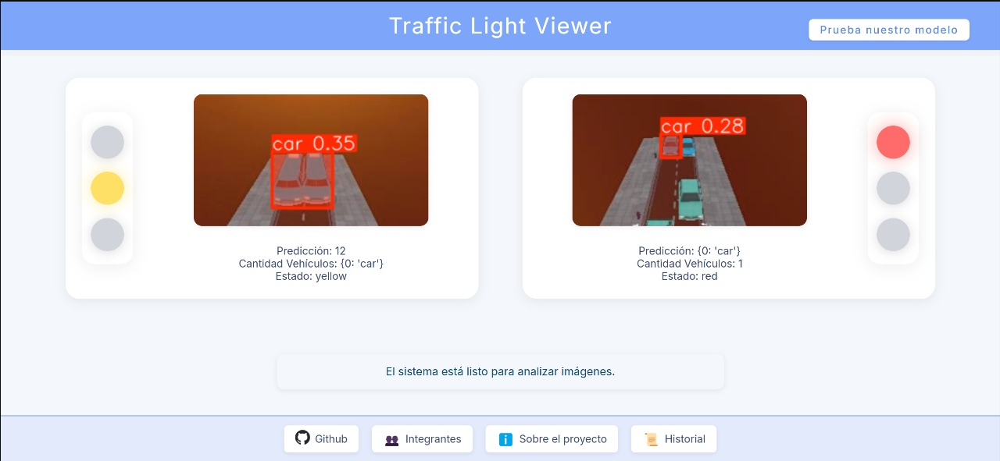
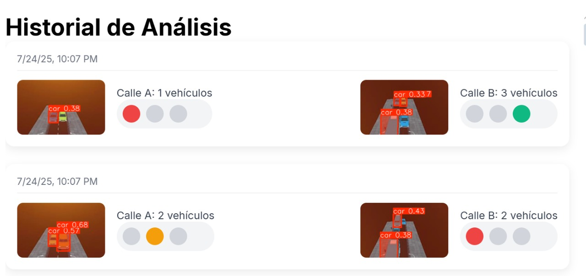

# Smart Traffic Control System

> A full-stack AI-powered system for real-time vehicle detection and dynamic traffic light control.

[]()
[]()
[]()

---

## Table of Contents

- [Overview](#overview)
- [Key Features](#key-features)
- [Technologies Used](#technologies-used)
- [Getting Started](#getting-started)
  - [Frontend Setup (Angular)](#frontend-setup-angular)
  - [Backend Setup (Flask)](#backend-setup-flask)
- [Usage](#usage)
- [Screenshots / Demo](#screenshots--demo)

---

## Overview

This project implements a smart traffic control system that uses **real-time vehicle detection** to optimize traffic light timing dynamically. It integrates a **YOLO-based deep learning model** for object detection, a **Flask backend** to handle logic and API communication, and an **Angular frontend** for visualization and user interaction.

---

## Key Features

-  **Real-Time Vehicle Detection:** Detects and counts vehicles using YOLOv8 and OpenCV.
-  **Dynamic Traffic Light Timing:** Adjusts light durations based on detected traffic density.
-  **Interactive Web Interface:** Built with Angular to visualize traffic lights, cameras, and vehicle counts.
-  **Historical Data Storage:** Logs all processed analysis into a PostgreSQL database.
-  **RESTful Communication:** Handles image input, detection, control, and data access through APIs.

---

## Technologies Used

### Frontend
- Angular 20
- TypeScript
- HTML5 & CSS3

### Backend
- Python 3.10
- Flask (API server)
- YOLOv8 (Ultralytics)
- OpenCV
- PostgreSQL
- psycopg2 / SQLAlchemy

---

## Getting Started

Here we show the way to immplement both technologies to work properly

### Frontend Setup Angular

For using angular we must have installed npm and angular CLI.

```bin/bash
npm install
ng serve --proxy-config=proxy.conf.json
```


### Backend Setup Flask

For using angular we must have installed python, and the next requirements with pip


Flask==3.0.2
flask-cors==4.0.0
opencv-python==4.9.0.80
numpy==1.26.4
Pillow==10.2.0
ultralytics==8.1.37
psycopg2-binary==2.9.9


```bin/bash
python back.py || flask --app back run   ## use python3 if linux
```


## Screenshots demo

FrontEnd View

History View

